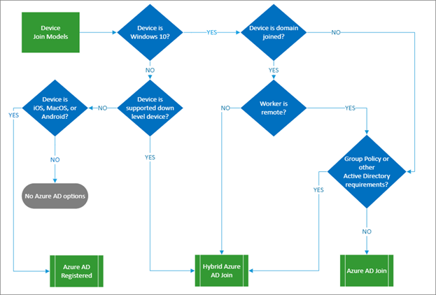

# Build resilience with device states

By enabling [device states](../devices/overview.md) with Azure Active Directory (Azure AD), administrators can author [Conditional Access policies](../conditional-access/overview.md) that control access to applications based on device state. Enabling device states satisfies strong authentication requirements for resource access, reduces multi-factor authentication (MFA) requests, and improves resiliency. 

The following flow chart presents ways to onboard devices in Azure AD that enable device states. You can use more than one in your organization.

When you use [device states](../devices/overview.md), in most cases users will experience single sign-on to resources through a [Primary Refresh Token](../devices/concept-primary-refresh-token.md) (PRT). The PRT contains claims about the user and the device. You can use these claims to get authentication tokens to access applications from the device. The PRT is valid for 14 days and is continuously renewed as long as the user actively uses the device, providing users a resilient experience. For more information about how a PRT can get multi-factor authentication claims, see [When does a PRT get an MFA claim](../devices/concept-primary-refresh-token.md).

## How do device states help?

When a PRT requests access to an application, its device, session, and MFA claims are trusted by Azure AD. When administrators create policies that require either a device-based control or a multi-factor authentication control, then the policy requirement can be met through its device state without attempting MFA. Users won't see more MFA prompts on the same device. This increases resilience to a disruption of the Azure AD Multi-Factor Authentication service or dependencies such as local telecom providers.

## How do I implement device states?

* Enable [hybrid Azure AD Joined](../devices/hybrid-join-plan.md) and [Azure AD Join](../devices/device-join-plan.md) for company-owned Windows devices and require they be joined, if possible. If not possible, require they be registered. If there are older versions of Windows in your organization, upgrade those devices to use Windows 10.
* Standardize user browser access to use either [Microsoft Edge](/deployedge/microsoft-edge-security-identity) or Google Chrome with [supported](https://chrome.google.com/webstore/detail/windows-10-accounts/ppnbnpeolgkicgegkbkbjmhlideopiji) [extensions](https://chrome.google.com/webstore/detail/office/ndjpnladcallmjemlbaebfadecfhkepb) that enable seamless SSO to web applications using the PRT.
* For personal or company-owned iOS and Android devices, deploy the [Microsoft Authenticator App](https://support.microsoft.com/account-billing/how-to-use-the-microsoft-authenticator-app-9783c865-0308-42fb-a519-8cf666fe0acc). In addition to MFA and password-less sign-in capabilities, the Microsoft Authenticator app enables single sign-on across native applications through [brokered authentication](../develop/msal-android-single-sign-on.md) with fewer authentication prompts for end users.
* For personal or company-owned iOS and Android devices, use [mobile application management](/mem/intune/apps/app-management) to securely access company resources with fewer authentication requests. 
* For macOS devices, use the [Microsoft Enterprise SSO plug-in for Apple devices (preview)](../develop/apple-sso-plugin.md) to register the device and provide SSO across browser and native Azure AD applications. Then, based on your environment, follow the steps specific to Microsoft Intune or Jamf Pro.

## Next steps

### Resilience resources for administrators and architects
 
* [Build resilience with credential management](resilience-in-credentials.md)
* [Build resilience by using Continuous Access Evaluation (CAE)](resilience-with-continuous-access-evaluation.md)
* [Build resilience in external user authentication](resilience-b2b-authentication.md)
* [Build resilience in your hybrid authentication](resilience-in-hybrid.md)
* [Build resilience in application access with Application Proxy](resilience-on-premises-access.md)

### Resilience resources for developers

* [Build IAM resilience in your applications](resilience-app-development-overview.md)
* [Build resilience in your CIAM systems](resilience-b2c.md)
