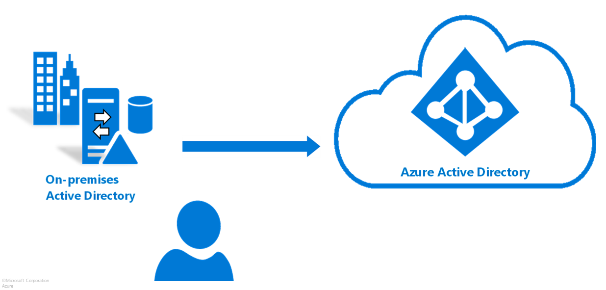

# Directory synchronization

Many organizations have a hybrid infrastructure that encompasses both on-premises and cloud components. Synchronizing users' identities between local and cloud directories lets users access resources with a single set of credentials.

Synchronization is the process of 

* creating an object based on certain conditions,
* keeping the object updated, and
* removing the object when conditions are no longer met.

On-premises provisioning involves provisioning from on-premises sources (such as Active Directory) to Azure Active Directory (Azure AD). 

## When to use directory synchronization

Use directory synchronization when you need to synchronize identity data from your on premises Active Directory environments to Azure AD as illustrated in the following diagram.

## System components

* **Azure AD**: Synchronizes identity information from organization's on premises directory via Azure AD Connect.
* **Azure AD Connect**: A tool for connecting on premises identity infrastructures to Microsoft Azure AD. The wizard and guided experiences help you to deploy and configure prerequisites and components required for the connection (including sync and sign on from Active Directories to Azure AD).
* **Active Directory**: Active Directory is a directory service that is included in most Windows Server operating systems. Servers that run Active Directory Domain Services (AD DS) are called domain controllers. They authenticate and authorize all users and computers in the domain.

Microsoft designed [Azure AD Connect cloud sync](../hybrid/cloud-sync/what-is-cloud-sync.md) to meet and accomplish your hybrid identity goals for synchronization of users, groups, and contacts to Azure AD. Azure AD Connect cloud sync uses the Azure AD cloud provisioning agent instead of the Azure AD Connect application.

## Implement directory synchronization with Azure AD

Explore the following resources to learn more about directory synchronization with Azure AD.

* [What is identity provisioning with Azure AD?](../hybrid/what-is-provisioning.md)Provisioning is the process of creating an object based on certain conditions, keeping the object up-to-date and deleting the object when conditions are no longer met. On-premises provisioning involves provisioning from on premises sources (like Active Directory) to Azure AD.
* [Hybrid Identity: Directory integration tools comparison](../hybrid/connect/plan-hybrid-identity-design-considerations-tools-comparison.md) describes differences between Azure AD Connect sync and Azure AD Connect cloud provisioning.
* [Azure AD Connect and Azure AD Connect Health installation roadmap](../hybrid/connect/how-to-connect-install-roadmap.md) provides detailed installation and configuration steps.

## Next steps

* [What is hybrid identity with Azure Active Directory?](../../active-directory/hybrid/whatis-hybrid-identity.md) Microsoft's identity solutions span on-premises and cloud-based capabilities. Hybrid identity solutions create a common user identity for authentication and authorization to all resources, regardless of location.
* [Install the Azure AD Connect provisioning agent](../hybrid/cloud-sync/how-to-install.md) walks you through the installation process for the Azure Active Directory (Azure AD) Connect provisioning agent and how to initially configure it in the Azure portal.
* [Azure AD Connect cloud sync new agent configuration](../hybrid/cloud-sync/how-to-configure.md) guides you through configuring Azure AD Connect cloud sync.
* [Azure Active Directory authentication and synchronization protocol overview](auth-sync-overview.md) describes integration with authentication and synchronization protocols. Authentication integrations enable you to use Azure AD and its security and management features with little or no changes to your applications that use legacy authentication methods. Synchronization integrations enable you to sync user and group data to Azure AD and then user Azure AD management capabilities. Some sync patterns enable automated provisioning.
