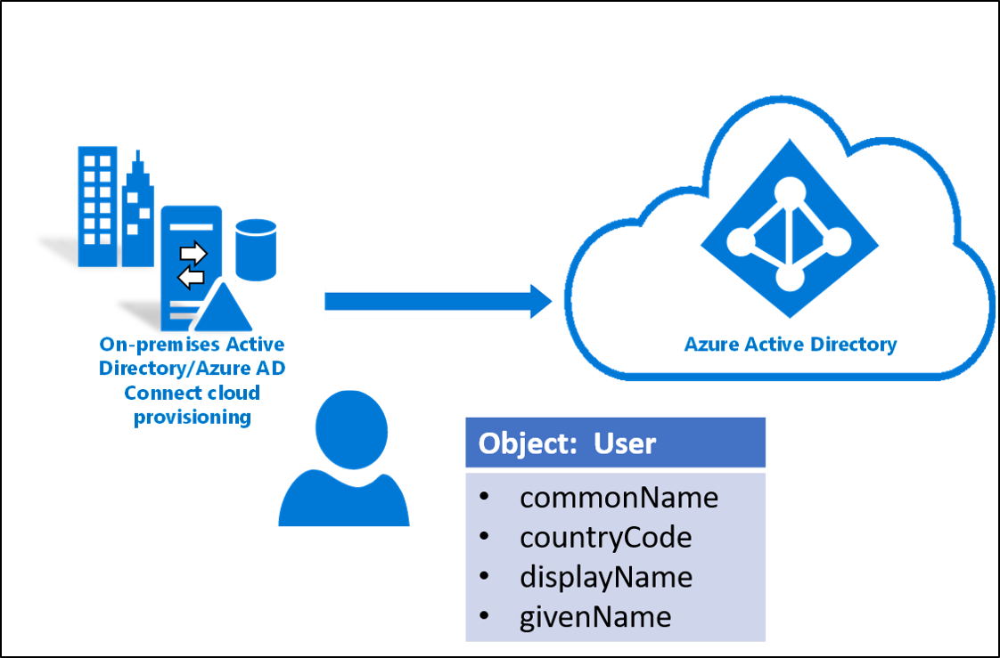
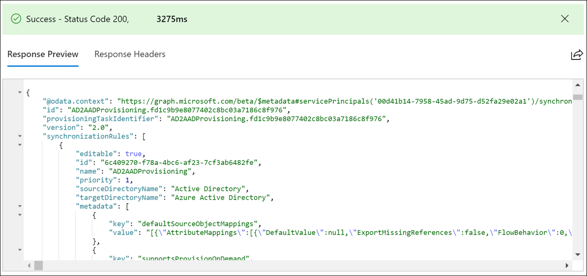

# Understand the Azure AD schema
An object in Azure Active Directory (Azure AD), like any directory, is a programmatic high-level data construct that represents such things as users, groups, and contacts. When you create a new user or contact in Azure AD, you're creating a new instance of that object. These instances can be differentiated based on their properties.

Properties in Azure AD are the elements responsible for storing information about an instance of an object in Azure AD.

The Azure AD schema defines the rules for which properties might be used in an entry, the kinds of values that those properties might have, and how users might interact with those values. 

Azure AD has two types of properties:
- **Built-in properties**: Properties that are predefined by the Azure AD schema. These properties provide different uses and might or might not be accessible.
- **Directory extensions**: Properties that are provided so that you can customize Azure AD for your own use. For example, if you've extended your on-premises Active Directory with a certain attribute and want to flow that attribute, you can use one of the custom properties that's provided. 

## Attributes and expressions
When an object such as a user is provisioned to Azure AD, a new instance of the user object is created. This creation includes the properties of that object, which are also known as attributes. Initially, the newly created object has its attributes set to values that are determined by the synchronization rules. These attributes are then kept up to date via the cloud provisioning agent.



For example, a user might be part of a Marketing department. Their Azure AD department attribute is initially created when they're provisioned, and the value is set to Marketing. Six months later if they change to Sales, their on-premises Active Directory department attribute is changed to Sales. This change synchronizes to Azure AD and is reflected in their Azure AD user object.

Attribute synchronization might be direct, where the value in Azure AD is directly set to the value of the on-premises attribute. Or, a programmatic expression might handle the synchronization. A programmatic expression is needed in cases where some logic or a determination must be made to populate the value.

For example, if you had the mail attribute "john.smith@contoso.com" and needed to strip out the "@contoso.com" portion and flow only the value "john.smith," you'd use something like this:

`Replace([mail], "@contoso.com", , ,"", ,)`  

**Sample input/output:** <br>

* **INPUT** (mail): "john.smith@contoso.com"
* **OUTPUT**: "john.smith"

For more information on how to write custom expressions and the syntax, see [Writing expressions for attribute mappings in Azure Active Directory](../../app-provisioning/functions-for-customizing-application-data.md).

The following table lists common attributes and how they're synchronized to Azure AD.


|On-premises Active Directory|Mapping type|Azure AD|
|-----|-----|-----|
|cn|Direct|commonName
|countryCode|Direct|countryCode|
|displayName|Direct|displayName|
|givenName|Expression|givenName|
|objectGUID|Direct|sourceAnchorBinary|	
|userprincipalName|Direct|userPrincipalName|
|ProxyAdress|Direct|ProxyAddress|

## View the schema
> [!WARNING]
> The cloud sync configuration creates a service principal. The service principal is visible in the Azure portal. You should not modify the attribute mappings using the service principal experience in the Azure portal.  This is not supported.

To view the schema and verify it, follow these steps.

1.  Go to [Graph Explorer](https://developer.microsoft.com/graph/graph-explorer).
1.  Sign in with your global administrator account.
1.  On the left, select **modify permissions** and ensure that **Directory.ReadWrite.All** is *Consented*.
1.  Run the query `https://graph.microsoft.com/beta/serviceprincipals/?$filter=startswith(DisplayName, ‘{sync config name}’)`. This query returns a filtered list of service principals.  This can also be acquired via the App Registration node under Azure Active Directory.
1.  Locate `"appDisplayName": "Active Directory to Azure Active Directory Provisioning"` and note the value for `"id"`.
    ```
    "value": [
            {
                "id": "00d41b14-7958-45ad-9d75-d52fa29e02a1",
                "deletedDateTime": null,
                "accountEnabled": true,
                "appDisplayName": "Active Directory to Azure Active Directory Provisioning",
                "appId": "1a4721b3-e57f-4451-ae87-ef078703ec94",
                "applicationTemplateId": null,
                "appOwnerOrganizationId": "47df5bb7-e6bc-4256-afb0-dd8c8e3c1ce8",
                "appRoleAssignmentRequired": false,
                "displayName": "Active Directory to Azure Active Directory Provisioning",
                "errorUrl": null,
                "homepage": "https://account.activedirectory.windowsazure.com:444/applications/default.aspx?metadata=AD2AADProvisioning|ISV9.1|primary|z",
                "loginUrl": null,
                "logoutUrl": null,
                "notificationEmailAddresses": [],
                "preferredSingleSignOnMode": null,
                "preferredTokenSigningKeyEndDateTime": null,
                "preferredTokenSigningKeyThumbprint": null,
                "publisherName": "Active Directory Application Registry",
                "replyUrls": [],
                "samlMetadataUrl": null,
                "samlSingleSignOnSettings": null,
                "servicePrincipalNames": [
                    "http://adapplicationregistry.onmicrosoft.com/adprovisioningtoaad/primary",
                    "1a4721b3-e57f-4451-ae87-ef078703ec94"
                ],
                "signInAudience": "AzureADMultipleOrgs",
                "tags": [
                    "WindowsAzureActiveDirectoryIntegratedApp"
                ],
                "addIns": [],
                "api": {
                    "resourceSpecificApplicationPermissions": []
                },
                "appRoles": [
                    {
                        "allowedMemberTypes": [
                            "User"
                        ],
                        "description": "msiam_access",
                        "displayName": "msiam_access",
                        "id": "a0326856-1f51-4311-8ae7-a034d168eedf",
                        "isEnabled": true,
                        "origin": "Application",
                        "value": null
                    }
                ],
                "info": {
                    "termsOfServiceUrl": null,
                    "supportUrl": null,
                    "privacyStatementUrl": null,
                    "marketingUrl": null,
                    "logoUrl": null
                },
                "keyCredentials": [],
                "publishedPermissionScopes": [
                    {
                        "adminConsentDescription": "Allow the application to access Active Directory to Azure Active Directory Provisioning on behalf of the signed-in user.",
                        "adminConsentDisplayName": "Access Active Directory to Azure Active Directory Provisioning",
                        "id": "d40ed463-646c-4efe-bb3e-3fa7d0006688",
                        "isEnabled": true,
                        "type": "User",
                        "userConsentDescription": "Allow the application to access Active Directory to Azure Active Directory Provisioning on your behalf.",
                        "userConsentDisplayName": "Access Active Directory to Azure Active Directory Provisioning",
                        "value": "user_impersonation"
                    }
                ],
                "passwordCredentials": []
            },
    ```
1. Replace `{Service Principal id}` with your value, and run the query `https://graph.microsoft.com/beta/serviceprincipals/{Service Principal id}/synchronization/jobs/`.
1. Locate `"id": "AD2AADProvisioning.fd1c9b9e8077402c8bc03a7186c8f976"` and note the value for `"id"`.
    ```
    {
                "id": "AD2AADProvisioning.fd1c9b9e8077402c8bc03a7186c8f976",
                "templateId": "AD2AADProvisioning",
                "schedule": {
                    "expiration": null,
                    "interval": "PT2M",
                    "state": "Active"
                },
                "status": {
                    "countSuccessiveCompleteFailures": 0,
                    "escrowsPruned": false,
                    "code": "Active",
                    "lastSuccessfulExecutionWithExports": null,
                    "quarantine": null,
                    "steadyStateFirstAchievedTime": "2019-11-08T15:48:05.7360238Z",
                    "steadyStateLastAchievedTime": "2019-11-20T16:17:24.7957721Z",
                    "troubleshootingUrl": "",
                    "lastExecution": {
                        "activityIdentifier": "2dea06a7-2960-420d-931e-f6c807ebda24",
                        "countEntitled": 0,
                        "countEntitledForProvisioning": 0,
                        "countEscrowed": 15,
                        "countEscrowedRaw": 15,
                        "countExported": 0,
                        "countExports": 0,
                        "countImported": 0,
                        "countImportedDeltas": 0,
                        "countImportedReferenceDeltas": 0,
                        "state": "Succeeded",
                        "error": null,
                        "timeBegan": "2019-11-20T16:15:21.116098Z",
                        "timeEnded": "2019-11-20T16:17:24.7488681Z"
                    },
                    "lastSuccessfulExecution": {
                        "activityIdentifier": null,
                        "countEntitled": 0,
                        "countEntitledForProvisioning": 0,
                        "countEscrowed": 0,
                        "countEscrowedRaw": 0,
                        "countExported": 5,
                        "countExports": 0,
                        "countImported": 0,
                        "countImportedDeltas": 0,
                        "countImportedReferenceDeltas": 0,
                        "state": "Succeeded",
                        "error": null,
                        "timeBegan": "0001-01-01T00:00:00Z",
                        "timeEnded": "2019-11-20T14:09:46.8855027Z"
                    },
                    "progress": [],
                    "synchronizedEntryCountByType": [
                        {
                            "key": "group to Group",
                            "value": 33
                        },
                        {
                            "key": "user to User",
                            "value": 3
                        }
                    ]
                },
                "synchronizationJobSettings": [
                    {
                        "name": "Domain",
                        "value": "{\"DomainFQDN\":\"contoso.com\",\"DomainNetBios\":\"CONTOSO\",\"ForestFQDN\":\"contoso.com\",\"ForestNetBios\":\"CONTOSO\"}"
                    },
                    {
                        "name": "DomainFQDN",
                        "value": "contoso.com"
                    },
                    {
                        "name": "DomainNetBios",
                        "value": "CONTOSO"
                    },
                    {
                        "name": "ForestFQDN",
                        "value": "contoso.com"
                    },
                    {
                        "name": "ForestNetBios",
                        "value": "CONTOSO"
                    },
                    {
                        "name": "QuarantineTooManyDeletesThreshold",
                        "value": "500"
                    }
                ]
            }
    ```
1. Now run the query `https://graph.microsoft.com/beta/serviceprincipals/{Service Principal Id}/synchronization/jobs/{AD2AAD Provisioning id}/schema`.
 


   Replace `{Service Principal Id}` and `{AD2ADD Provisioning Id}` with your values.

1. This query returns the schema.

   
 
## Next steps

- [What is provisioning?](../what-is-provisioning.md)
- [What is Azure AD Connect cloud sync?](what-is-cloud-sync.md)
