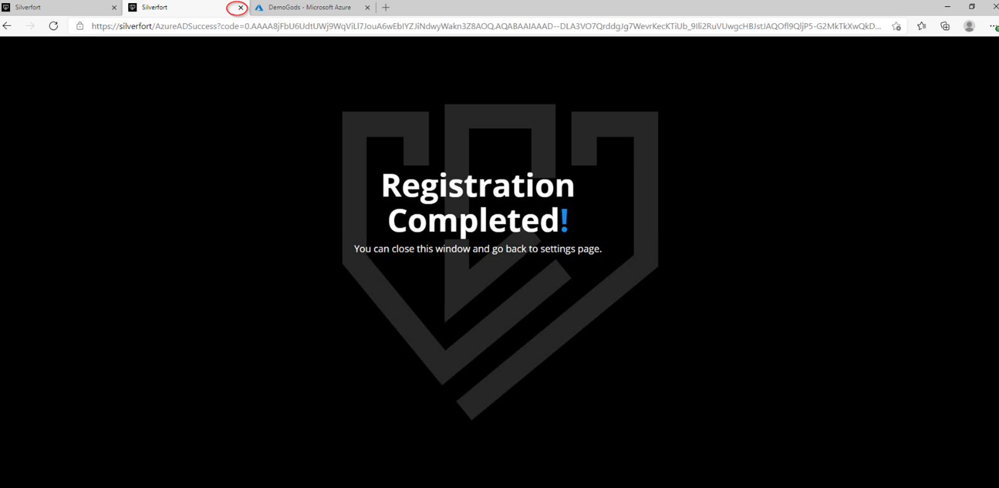
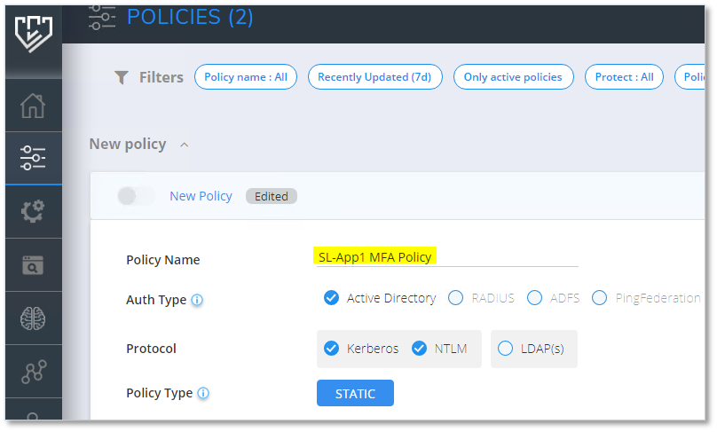
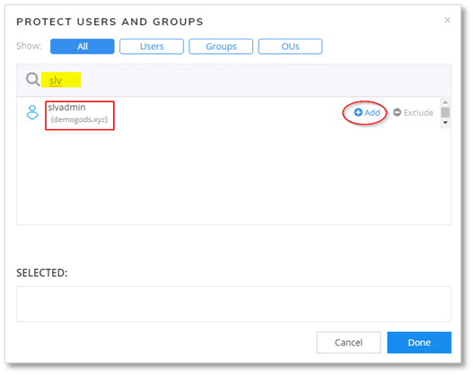
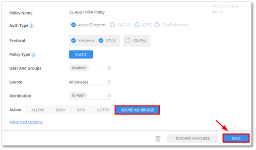

# Tutorial: Configure Secure Hybrid Access with Azure Active Directory and Silverfort  

[Silverfort](https://www.silverfort.com/) uses agent-less and proxy-less technology to connect your assets on-premises and in the cloud to Azure Active Directory (Azure AD). This solution enables organizations to apply identity protection, visibility, and user experience across environments in Azure AD. It enables universal risk-based monitoring and assessment of authentication activity for on-premises and cloud environments, and helps to prevent threats.  

In this tutorial, learn how to integrate your on-premises Silverfort implementation with Azure AD.

Learn more: [Hybrid Azure AD joined devices](../devices/concept-hybrid-join.md).

Silverfort connects assets with Azure AD. These bridged assets appear as regular applications in Azure AD and can be protected with [Conditional Access](../conditional-access/overview.md), single-sign-on (SSO), multi-factor authentication (MFA), auditing and more. Use Silverfort to connect assets including:

- Legacy and homegrown applications
- Remote desktop and Secure Shell (SSH)
- Command-line tools and other admin access
- File shares and databases
- Infrastructure and industrial systems

Silverfort integrates your corporate assets and third-party Identity and Access Management (IAM) platforms. This includes Active Directory, Active Directory Federation Services (ADFS), and Remote Authentication Dial-In User Service (RADIUS) on Azure AD, including hybrid and multicloud environments.

Use this tutorial to configure and test the Silverfort Azure AD bridge in your Azure AD tenant to communicate with your Silverfort implementation. After configuration, you can create Silverfort authentication policies that bridge authentication requests from identity sources to Azure AD for SSO. After an application is bridged, you can manage it in Azure AD.

## Silverfort with Azure AD authentication architecture

The following diagram shows the authentication architecture orchestrated by Silverfort, in a hybrid environment.

### User flow

1. User sends authentication request to the original Identity Provider (IdP) through protocols such as Kerberos, SAML, NTLM, OIDC, and LDAP(s)
2. The response is routed as-is to Silverfort for validation to check authentication state
3. Silverfort provides visibility, discovery, and a bridge to Azure AD
4. If the application is bridged, the authentication decision passes to Azure AD. Azure AD evaluates Conditional Access policies and validates authentication.
5. The authentication state response goes as-is from Silverfort to the IdP
6. IdP grants or denies access to the resource
7. User is notified if access request is granted or denied 

## Prerequisites

You need Silverfort deployed in your tenant or infrastructure to perform this tutorial. To deploy Silverfort in your tenant or infrastructure, go to silverfort.com [Silverfort](https://www.silverfort.com/) to install the Silverfort desktop app on your workstations.

Set up Silverfort Azure AD Adapter in your Azure AD tenant:

- An Azure account with an active subscription
  - You can create an [Azure free account](https://azure.microsoft.com/free/?WT.mc_id=A261C142F)
- One of the following roles in your Azure account: 
  - Global Administrator
  - Cloud Application Administrator
  - Application Administrator
  - Service Principal Owner
- The Silverfort Azure AD Adapter application in the Azure AD gallery is pre-configured to support SSO. From the gallery, add the Silverfort Azure AD Adapter to your tenant as an Enterprise application.

## Configure Silverfort and create a policy

1. From a browser, sign in to the Silverfort admin console.
2. In the main menu, navigate to **Settings** and then scroll to **Azure AD Bridge Connector** in the General section. 
3. Confirm your tenant ID, and then select **Authorize**.
4. Select **Save Changes**.
5. On the **Permissions requested** dialog, select **Accept**.

   

   

6. A Registration Completed message appears in a new tab. Close this tab.

   

7. On the **Settings** page, select **Save Changes**.

   

8. Sign in to your Azure AD console. In the left pane, select **Enterprise applications**. The **Silverfort Azure AD Adapter** application appears as registered.

   

9. In the Silverfort admin console, navigate to the **Policies** page and select **Create Policy**. The **New Policy** dialog appears. 
10. Enter a **Policy Name**, the application name to be created in Azure. For example, if adding multiple servers or applications for this policy, name it to reflect the resources covered by the policy. In the example, we create a policy for the SL-APP1 server.

   

11. Select the **Auth Type**, and **Protocol**.

12. In the **Users and Groups** field, select the **edit** icon to configure users affected by the policy. These users' authentication bridges to Azure AD.

   

13. Search and select users, groups, or Organization Units (OUs).

   

14. Selected users appear in the **SELECTED** box.

   

15. Select the **Source** for which the policy will apply. In this example, **All Devices** is selected.

    

16. Set the **Destination** to SL-App1. Optional: You can select the **edit** button to change or add more resources, or groups of resources.

    

17. For Action, select **AZURE AD BRIDGE**.

    

18. Select **Save**. You're prompted to turn on the policy. 

    

19. In the Azure AD Bridge section, the policy appears on the Policies page.

    

20. Return to the Azure AD console, and navigate to **Enterprise applications**. The new Silverfort application appears. You can include this application in Conditional Access policies. 

Learn more: [Tutorial: Secure user sign-in events with Azure AD Multi-Factor Authentication](../authentication/tutorial-enable-azure-mfa.md?bc=/azure/active-directory/conditional-access/breadcrumb/toc.json&toc=/azure/active-directory/conditional-access/toc.json#create-a-conditional-access-policy).

## Next steps

- [Silverfort Azure AD adapter](https://azuremarketplace.microsoft.com/marketplace/apps/aad.silverfortazureadadapter?tab=overview)
- [Silverfort resources](https://www.silverfort.com/resources/)
- [Silverfort, company contact](https://www.silverfort.com/company/contact/)
