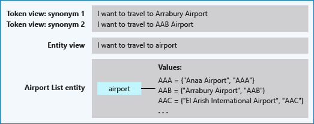

# List entity

[!INCLUDE [deprecation notice](./includes/deprecation-notice.md)]


List entities represent a fixed, closed set of related words along with their synonyms. LUIS does not discover additional values for list entities. Use the **Recommend** feature to see suggestions for new words based on the current list. If there is more than one list entity with the same value, each entity is returned in the endpoint query.

A list entity isn't machine-learned. It is an exact text match. LUIS marks any match to an item in any list as an entity in the response.

**The entity is a good fit when the text data:**

* Are a known set.
* Doesn't change often. If you need to change the list often or want the list to self-expand, a simple entity boosted with a phrase list is a better choice.
* The set doesn't exceed the maximum LUIS [boundaries](luis-limits.md) for this entity type.
* The text in the utterance is a case-insensitive match with a synonym or the canonical name. LUIS doesn't use the list beyond the match. Fuzzy matching, stemming, plurals, and other variations are not resolved with a list entity. To manage variations, consider using a [pattern](reference-pattern-syntax.md#syntax-to-mark-optional-text-in-a-template-utterance) with the optional text syntax.



## Example .json to import into list entity

  You can import values into an existing list entity using the following .json format:

  ```JSON
  [
      {
          "canonicalForm": "Blue",
          "list": [
              "navy",
              "royal",
              "baby"
          ]
      },
      {
          "canonicalForm": "Green",
          "list": [
              "kelly",
              "forest",
              "avacado"
          ]
      }
  ]
  ```

## Example JSON response

Suppose the app has a list, named `Cities`, allowing for variations of city names including city of airport (Sea-tac), airport code (SEA), postal zip code (98101), and phone area code (206).

|List item|Item synonyms|
|---|---|
|`Seattle`|`sea-tac`, `sea`, `98101`, `206`, `+1` |
|`Paris`|`cdg`, `roissy`, `ory`, `75001`, `1`, `+33`|

`book 2 tickets to paris`

In the previous utterance, the word `paris` is mapped to the paris item as part of the `Cities` list entity. The list entity matches both the item's normalized name as well as the item synonyms.

#### [V2 prediction endpoint response](#tab/V2)

```JSON
  "entities": [
    {
      "entity": "paris",
      "type": "Cities",
      "startIndex": 18,
      "endIndex": 22,
      "resolution": {
        "values": [
          "Paris"
        ]
      }
    }
  ]
```

#### [V3 prediction endpoint response](#tab/V3)

This is the JSON if `verbose=false` is set in the query string:

```json
"entities": {
    "Cities": [
        [
            "Paris"
        ]
    ]
}
```

This is the JSON if `verbose=true` is set in the query string:

```json
"entities": {
    "Cities": [
        [
            "Paris"
        ]
    ],
    "$instance": {
        "Cities": [
            {
                "type": "Cities",
                "text": "paris",
                "startIndex": 18,
                "length": 5,
                "modelTypeId": 5,
                "modelType": "List Entity Extractor",
                "recognitionSources": [
                    "model"
                ]
            }
        ]
    }
}
```

* * *

|Data object|Entity name|Value|
|--|--|--|
|List Entity|`Cities`|`paris`|

## Next steps

Learn more about entities:

* [Entity types](concepts/entities.md)
* [Create entities](how-to/entities.md)
