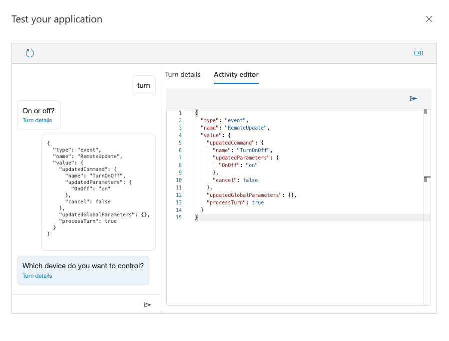
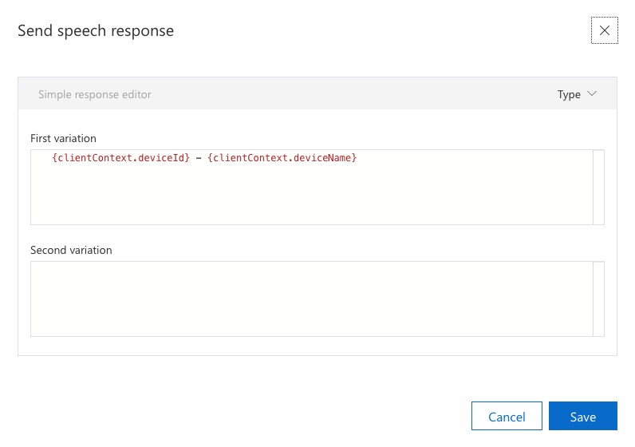
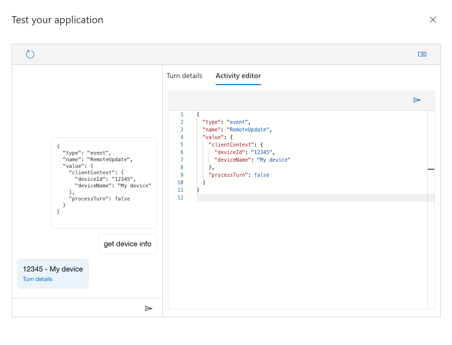

# Update a command from a client app

[!INCLUDE [deprecation notice](./includes/custom-commands-retire.md)]

In this article, you'll learn how to update an ongoing command from a client application.

## Prerequisites
> [!div class = "checklist"]
> * A previously [created Custom Commands app](quickstart-custom-commands-application.md)

## Update the state of a command

If your client application requires you to update the state of an ongoing command without voice input, you can send an event to update the command.

To illustrate this scenario, send the following event activity to update the state of an ongoing command (`TurnOnOff`): 

```json
{
  "type": "event",
  "name": "RemoteUpdate",
  "value": {
    "updatedCommand": {
      "name": "TurnOnOff",
      "updatedParameters": {
        "OnOff": "on"
      },
      "cancel": false
    },
    "updatedGlobalParameters": {},
    "processTurn": true
  }
}
```

Let's review the key attributes of this activity:

| Attribute | Explanation |
| ---------------- | --------------------------------------------------------------------------------------------------------------------------- |
| **type** | The activity is of type `"event"`. |
| **name** | The name of the event needs to be `"RemoteUpdate"`. |
| **value** | The attribute `"value"` contains the attributes required to update the current command. |
| **updatedCommand** | The attribute `"updatedCommand"` contains the name of the command. Within that attribute, `"updatedParameters"` is a map with the names of the parameters and their updated values. |
| **cancel** | If the ongoing command needs to be canceled, set the attribute `"cancel"` to `true`. |
| **updatedGlobalParameters** | The attribute `"updatedGlobalParameters"` is a map just like `"updatedParameters"`, but it's used for global parameters. |
| **processTurn** | If the turn needs to be processed after the activity is sent, set the attribute `"processTurn"` to `true`. |

You can test this scenario in the Custom Commands portal:

1. Open the Custom Commands application that you previously created. 
1. Select **Train** and then **Test**.
1. Send `turn`.
1. Open the side panel and select **Activity editor**.
1. Type and send the `RemoteCommand` event specified in the previous section.
    > [!div class="mx-imgBorder"]
    > 

Note how the value for the parameter `"OnOff"` was set to `"on"` through an activity from the client instead of speech or text.

## Update the catalog of the parameter for a command

When you configure the list of valid options for a parameter, the values for the parameter are defined globally for the application. 

In our example, the `SubjectDevice` parameter will have a fixed list of supported values regardless of the conversation.

If you want to add new entries to the parameter's catalog per conversation, you can send the following activity:

```json
{
  "type": "event",
  "name": "RemoteUpdate",
  "value": {
    "catalogUpdate": {
      "commandParameterCatalogs": {
        "TurnOnOff": [
          {
            "name": "SubjectDevice",
            "values": {
              "stereo": [
                "cd player"
              ]
            }
          }
        ]
      }
    },
    "processTurn": false
  }
}
```
With this activity, you added an entry for `"stereo"` to the catalog of the parameter `"SubjectDevice"` in the command `"TurnOnOff"`.

> [!div class="mx-imgBorder"]
> :::image type="content" source="./media/custom-commands/update-catalog-with-remote-activity.png" alt-text="Screenshot that shows a catalog update.":::

Note a couple of things:
- You need to send this activity only once (ideally, right after you start a connection).
- After you send this activity, you should wait for the event `ParameterCatalogsUpdated` to be sent back to the client.

## Add more context from the client application

You can set additional context from the client application per conversation that can later be used in your Custom Commands application. 

For example, think about the scenario where you want to send the ID and name of the device connected to the Custom Commands application.

To test this scenario, let's create a new command in the current application:
1. Create a new command called `GetDeviceInfo`.
1. Add an example sentence of `get device info`.
1. In the completion rule **Done**, add a **Send speech response** action that contains the attributes of `clientContext`.
   
1. Save, train, and test your application.
1. In the testing window, send an activity to update the client context.

    ```json
    {
       "type": "event",
       "name": "RemoteUpdate",
       "value": {
         "clientContext": {
           "deviceId": "12345",
           "deviceName": "My device"
         },
         "processTurn": false
       }
    }
    ```
1. Send the text `get device info`.
   

Note a few things:
- You need to send this activity only once (ideally, right after you start a connection).
- You can use complex objects for `clientContext`.
- You can use `clientContext` in speech responses, for sending activities and for calling web endpoints.

## Next steps

> [!div class="nextstepaction"]
> [Update a command from a web endpoint](./how-to-custom-commands-update-command-from-web-endpoint.md)
