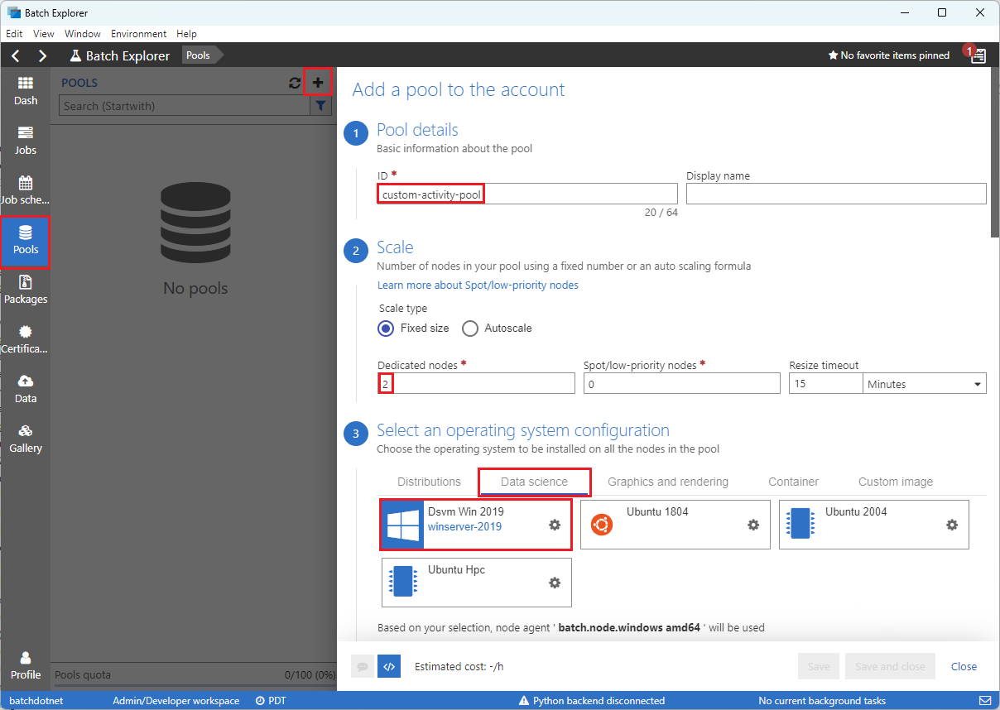
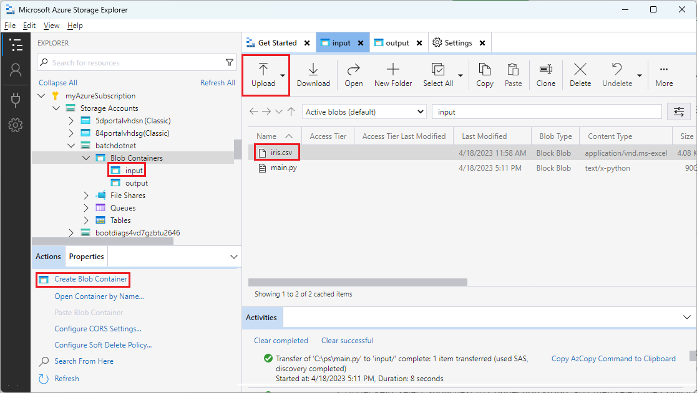
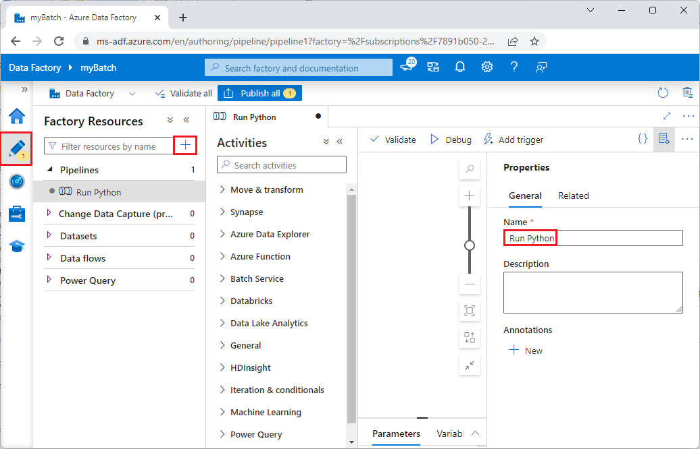
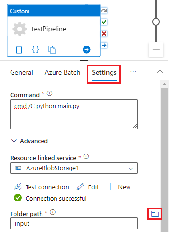

# Tutorial: Run a Batch job through Data Factory with Batch Explorer, Storage Explorer, and Python

This tutorial walks you through creating and running an Azure Data Factory pipeline that runs an Azure Batch workload. A Python script runs on the Batch nodes to get comma-separated value (CSV) input from an Azure Blob Storage container, manipulate the data, and write the output to a different storage container. You use Batch Explorer to create a Batch pool and nodes, and Azure Storage Explorer to work with storage containers and files.

In this tutorial, you learn how to:

> [!div class="checklist"]
> - Use Batch Explorer to create a Batch pool and nodes.
> - Use Storage Explorer to create storage containers and upload input files.
> - Develop a Python script to manipulate input data and produce output.
> - Create a Data Factory pipeline that runs the Batch workload.
> - Use Batch Explorer to look at the output log files.

## Prerequisites

- An Azure account with an active subscription. If you don't have one, [create a free account](https://azure.microsoft.com/free).
- A Batch account with a linked Azure Storage account. You can create the accounts by using any of the following methods: [Azure portal](quick-create-portal.md) | [Azure CLI](quick-create-cli.md) | [Bicep](quick-create-bicep.md) | [ARM template](quick-create-template.md) | [Terraform](quick-create-terraform.md).
- A Data Factory instance. To create the data factory, follow the instructions in [Create a data factory](/azure/data-factory/quickstart-create-data-factory-portal#create-a-data-factory).
- [Batch Explorer](https://azure.github.io/BatchExplorer) downloaded and installed.
- [Storage Explorer](https://azure.microsoft.com/products/storage/storage-explorer) downloaded and installed.
- [Python 3.7 or above](https://www.python.org/downloads), with the [azure-storage-blob](https://pypi.org/project/azure-storage-blob) package installed by using `pip`.
- The [iris.csv input dataset](https://github.com/Azure-Samples/batch-adf-pipeline-tutorial/blob/master/iris.csv) downloaded from GitHub.

## Use Batch Explorer to create a Batch pool and nodes

Use Batch Explorer to create a pool of compute nodes to run your workload.

1. Sign in to Batch Explorer with your Azure credentials.
1. Select your Batch account.
1. Select **Pools** on the left sidebar, and then select the **+** icon to add a pool.

   [ ](media/run-python-batch-azure-data-factory/batch-explorer-add-pool.png#lightbox)

1. Complete the **Add a pool to the account** form as follows:

   - Under **ID**, enter *custom-activity-pool*.
   - Under **Dedicated nodes**, enter *2*.
   - For **Select an operating system configuration**, select the **Data science** tab, and then select **Dsvm Win 2019**.
   - For **Choose a virtual machine size**, select **Standard_F2s_v2**.
   - For **Start Task**, select **Add a start task**.
     On the start task screen, under **Command line**, enter `cmd /c "pip install azure-storage-blob pandas"`, and then select **Select**. This command installs the `azure-storage-blob` package on each node as it starts up.

1. Select **Save and close**.

## Use Storage Explorer to create blob containers

Use Storage Explorer to create blob containers to store input and output files, and then upload your input files.

1. Sign in to Storage Explorer with your Azure credentials.
1. In the left sidebar, locate and expand the storage account that's linked to your Batch account. 
1. Right-click **Blob Containers**, and select **Create Blob Container**, or select **Create Blob Container** from **Actions** at the bottom of the sidebar.
1. Enter *input* in the entry field.
1. Create another blob container named *output*.
1. Select the **input** container, and then select **Upload** > **Upload files** in the right pane.
1. On the **Upload files** screen, under **Selected files**, select the ellipsis **...** next to the entry field.
1. Browse to the location of your downloaded *iris.csv* file, select **Open**, and then select **Upload**.

[ ](media/run-python-batch-azure-data-factory/storage-explorer.png#lightbox)
## Develop a Python script

The following Python script loads the *iris.csv* dataset file from your Storage Explorer **input** container, manipulates the data, and saves the results to the **output** container.

The script needs to use the connection string for the Azure Storage account that's linked to your Batch account. To get the connection string:

1. In the [Azure portal](https://portal.azure.com), search for and select the name of the storage account that's linked to your Batch account.
1. On the page for the storage account, select **Access keys** from the left navigation under **Security + networking**.
1. Under **key1**, select **Show** next to **Connection string**, and then select the **Copy** icon to copy the connection string.

Paste the connection string into the following script, replacing the `<storage-account-connection-string>` placeholder. Save the script as a file named *main.py*.

>[!IMPORTANT]
>Exposing account keys in the app source isn't recommended for Production usage. You should restrict access to credentials and refer to them in your code by using variables or a configuration file. It's best to store Batch and Storage account keys in Azure Key Vault.

``` python
# Load libraries
from azure.storage.blob import BlobClient
import pandas as pd

# Define parameters
connectionString = "<storage-account-connection-string>"
containerName = "output"
outputBlobName	= "iris_setosa.csv"

# Establish connection with the blob storage account
blob = BlobClient.from_connection_string(conn_str=connectionString, container_name=containerName, blob_name=outputBlobName)

# Load iris dataset from the task node
df = pd.read_csv("iris.csv")

# Take a subset of the records
df = df[df['Species'] == "setosa"]

# Save the subset of the iris dataframe locally in the task node
df.to_csv(outputBlobName, index = False)

with open(outputBlobName, "rb") as data:
    blob.upload_blob(data, overwrite=True)
```

Run the script locally to test and validate functionality. 

``` bash
python main.py
```

The script should produce an output file named *iris_setosa.csv* that contains only the data records that have Species = setosa. After you verify that it works correctly, upload the *main.py* script file to your Storage Explorer **input** container.

## Set up a Data Factory pipeline

Create and validate a Data Factory pipeline that uses your Python script.

### Get account information

The Data Factory pipeline uses your Batch and Storage account names, account key values, and Batch account endpoint. To get this information from the [Azure portal](https://portal.azure.com):

1. From the Azure Search bar, search for and select your Batch account name.
1. On your Batch account page, select **Keys** from the left navigation.
1. On the **Keys** page, copy the following values:

   - **Batch account**
   - **Account endpoint**
   - **Primary access key**
   - **Storage account name**
   - **Key1**

### Create and run the pipeline

1. If Azure Data Factory Studio isn't already running, select **Launch studio** on your Data Factory page in the Azure portal.
1. In Data Factory Studio, select the **Author** pencil icon in the left navigation.
1. Under **Factory Resources**, select the **+** icon, and then select **Pipeline**.
1. In the **Properties** pane on the right, change the name of the pipeline to *Run Python*.

   [ ](media/run-python-batch-azure-data-factory/create-pipeline.png#lightbox)

1. In the **Activities** pane, expand **Batch Service**, and drag the **Custom** activity to the pipeline designer surface.
1. Below the designer canvas, on the **General** tab, enter *testPipeline* under **Name**.

   

1. Select the **Azure Batch** tab, and then select **New**.
1. Complete the **New linked service** form as follows:

   - **Name**: Enter a name for the linked service, such as **AzureBatch1**.
   - **Access key**: Enter the primary access key you copied from your Batch account.
   - **Account name**: Enter your Batch account name.
   - **Batch URL**: Enter the account endpoint you copied from your Batch account, such as `https://batchdotnet.eastus.batch.azure.com`.
   - **Pool name**: Enter *custom-activity-pool*, the pool you created in Batch Explorer.
   - **Storage account linked service name**: Select **New**. On the next screen, enter a **Name** for the linked storage service, such as *AzureBlobStorage1*, select your Azure subscription and linked storage account, and then select **Create**.

1. At the bottom of the Batch **New linked service** screen, select **Test connection**. When the connection is successful, select **Create**.

   

1. Select the **Settings** tab, and enter or select the following settings:

   - **Command**: Enter `cmd /C python main.py`.
   - **Resource linked service**: Select the linked storage service you created, such as **AzureBlobStorage1**, and test the connection to make sure it's successful.
   - **Folder path**: Select the folder icon, and then select the **input** container and select **OK**. The files from this folder download from the container to the pool nodes before the Python script runs.

   

1. Select **Validate** on the pipeline toolbar to validate the pipeline.
1. Select **Debug** to test the pipeline and ensure it works correctly.
1. Select **Publish all** to publish the pipeline.
1. Select **Add trigger**, and then select **Trigger now** to run the pipeline, or **New/Edit** to schedule it.

   

## Use Batch Explorer to view log files

If running your pipeline produces warnings or errors, you can use Batch Explorer to look at the *stdout.txt* and *stderr.txt* output files for more information.

1. In Batch Explorer, select **Jobs** from the left sidebar.
1. Select the **adfv2-custom-activity-pool** job.
1. Select a task that had a failure exit code.
1. View the *stdout.txt* and *stderr.txt* files to investigate and diagnose your problem.

## Clean up resources

Batch accounts, jobs, and tasks are free, but compute nodes incur charges even when they're not running jobs. It's best to allocate node pools only as needed, and delete the pools when you're done with them. Deleting pools deletes all task output on the nodes, and the nodes themselves.

Input and output files remain in the storage account and can incur charges. When you no longer need the files, you can delete the files or containers. When you no longer need your Batch account or linked storage account, you can delete them.

## Next steps

In this tutorial, you learned how to use a Python script with Batch Explorer, Storage Explorer, and Data Factory to run a Batch workload. For more information about Data Factory, see [What is Azure Data Factory?](/azure/data-factory/introduction)
