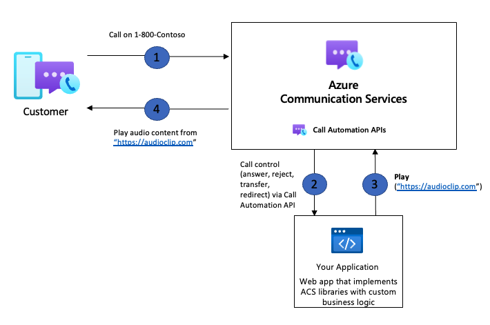

# Playing audio in call

The play action provided through the call automation SDK allows you to play audio prompts to participants in the call. This action can be accessed through the server-side implementation of your application. The play action allows you to provide Azure Communication Services access to your pre-recorded audio files with support for authentication. 

> [!NOTE]
> Azure Communication Services currently only supports WAV files formatted as mono channel audio recorded at 16KHz. You can create your own audio files using [Speech synthesis with Audio Content Creation tool](../../../ai-services/Speech-Service/how-to-audio-content-creation.md). 

The Play action allows you to provide access to a pre-recorded audio file of WAV format that Azure Communication Services can access with support for authentication. 

## Common use cases 

The play action can be used in many ways, below are some examples of how developers may wish to use the play action in their applications. 

### Announcements
Your application might want to play some sort of announcement when a participant joins or leaves the call, to notify other users.

### Self-serve customers

In scenarios with IVRs and virtual assistants, you can use your application or bots to play audio prompts to callers, this prompt can be in the form of a menu to guide the caller through their interaction.

### Hold music
The play action can also be used to play hold music for callers. This action can be set up in a loop so that the music keeps playing until an agent is available to assist the caller.

### Playing compliance messages
As part of compliance requirements in various industries, vendors are expected to play legal or compliance messages to callers, for example, “This call will be recorded for quality purposes”.

## Sample architecture for playing audio in a call

## Known limitations
- Play action isn't enabled to work with Teams Interoperability.

## Next Steps
- Check out our how-to guide to learn [how-to play custom voice prompts](../../how-tos/call-automation/play-action.md) to users.
- Learn about [usage and operational logs](../analytics/logs/call-automation-logs.md) published by call automation.
