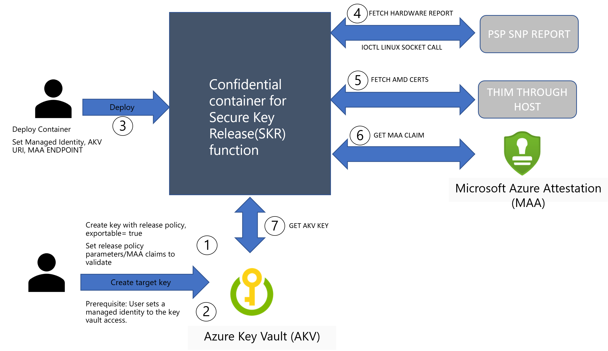

# Secure Key Release with Confidential containers on Azure Container Instance (ACI)

Secure Key Release (SKR) flow with Azure Key Vault (AKV) with confidential container offerings can implement in couple of ways. Confidential containers run a guest enlightened exposting AMD SEV-SNP device through a Linux Kernel that uses an in guest firmware with necessary Hyper-V related patches that we refer as Direct Linux Boot (DLB). This platform doesn't use vTPM and HCL based that Confidential VMs with AMD SEV-SNP support. This concept document assumes you plan to run the containers in [Azure Container Support choosing a confidential computing SKU](../container-instances/container-instances-tutorial-deploy-confidential-containers-cce-arm.md)

- Side-Car Helper Container provided by Azure
- Custom implementation with your container application

## Side-Car helper container provided by Azure

An [open sourced GitHub project "confidential side-cars"](https://github.com/microsoft/confidential-sidecar-containers) details how to build this container and what parameters/environment variables are required for you to prepare and run this side-car container. The current side car implementation provides various HTTP REST APIs that your primary application container can use to fetch the key from AKV. The integration through Microsoft Azure Attestation(MAA) is already built in. The preparation steps to run the side-car SKR container can be found in details [here](https://github.com/microsoft/confidential-sidecar-containers/tree/main/examples/skr).

Your main application container application can call the side-car WEB API end points as defined in the example below. Side-cars runs within the same container group and is a local endpoint to your application container. Full details of the API can be found [here](https://github.com/microsoft/confidential-sidecar-containers/blob/main/cmd/skr/README.md)
 
The `key/release` POST method expects a JSON of the following format:

```json
{	
    "maa_endpoint": "<maa endpoint>", //https://learn.microsoft.com/en-us/azure/attestation/quickstart-portal#attestation-provider
    "akv_endpoint": "<akv endpoint>", //AKV URI
    "kid": "<key identifier>" //key name,
    "access_token": "optional aad token if the command will run in a resource without proper managed identity assigned"
}
```

Upon success, the `key/release` POST method response carries a `StatusOK` header and a payload of the following format:

```json
{
    "key": "<key in JSON Web Key format>"
}
```

Upon error, the `key/release` POST method response carries a `StatusForbidden` header and a payload of the following format:

```json
{
    "error": "<error message>"
}
```

## Custom implementation with your container application

To perform a custom container application that extends the capability of Azure Key Vault (AKV) - Secure Key Release and Microsoft Azure Attestation (MAA), use the below as a high level reference flow. An easy approach is to review the current side-car implementation code in this [side-car GitHub project](https://github.com/microsoft/confidential-sidecar-containers/tree/d933d0f4e3d5498f7ed9137189ab6a23ade15466/pkg/common).



1. **Step 1:** Set up AKV with Exportable Key and attach the release policy. More [here](concept-skr-attestation.md)
1. **Step 2:** Set up a managed identity with Azure Active Directory and attach that to AKV. More [here](../container-instances/container-instances-managed-identity.md)
1. **Step 3:** Deploy your container application with required parameters within ACI by setting up a confidential computing enforcement policy. More [here](../container-instances/container-instances-tutorial-deploy-confidential-containers-cce-arm.md)
1. **Step 4:** In this step, your application shall fetch a RAW AMD SEV-SNP hardware report by doing a IOCTL Linux Socket call. You don't need any guest attestation library to perform this action. More on existing side-car [implementation](https://github.com/microsoft/confidential-sidecar-containers/blob/d933d0f4e3d5498f7ed9137189ab6a23ade15466/pkg/attest/snp.go)
1. **Step 5:** Fetch the AMD SEV-SNP cert chain for the container group. These certs are delivered from Azure host IMDS endpoint. More [here](https://github.com/microsoft/confidential-sidecar-containers/blob/d933d0f4e3d5498f7ed9137189ab6a23ade15466/pkg/common/info.go)
1. **Step 6:** Send the SNP RAW hardware report and cert details to MAA for verification and return claims. More [here](../attestation/basic-concepts.md)
1. **Step 7:** Send the MAA token and the managed identity token generated by ACI to AKV for key release. More [here](../container-instances/container-instances-managed-identity.md)

On success of the key fetch from AKV, you can consume the key for decrypting the data sets or encrypt the data going out of the confidential container environment.

## References

[ACI with Confidential container deployments](../container-instances/container-instances-tutorial-deploy-confidential-containers-cce-arm.md)

[Side-Car Implementation with encrypted blob fetch and decrypt with SKR AKV key](https://github.com/microsoft/confidential-sidecar-containers/#encrypted-filesystem-sidecar)

[AKV SKR with Confidential VM's AMD SEV-SNP](skr-flow-confidential-vm-sev-snp.md)

[Microsoft Azure Attestation (MAA)](../attestation/overview.md)

[SKR Policy Examples](skr-policy-examples.md)
