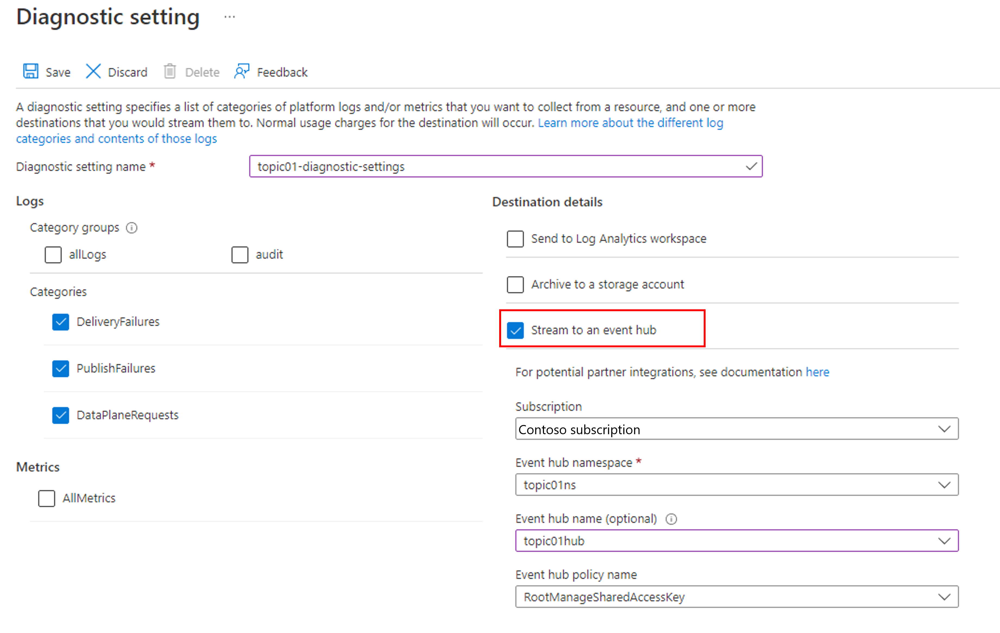
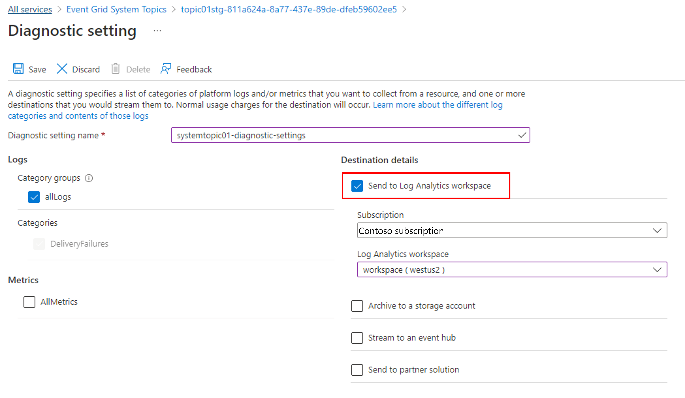
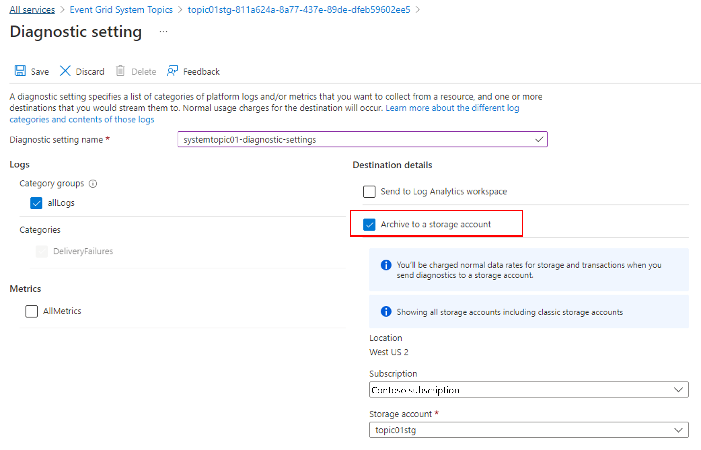
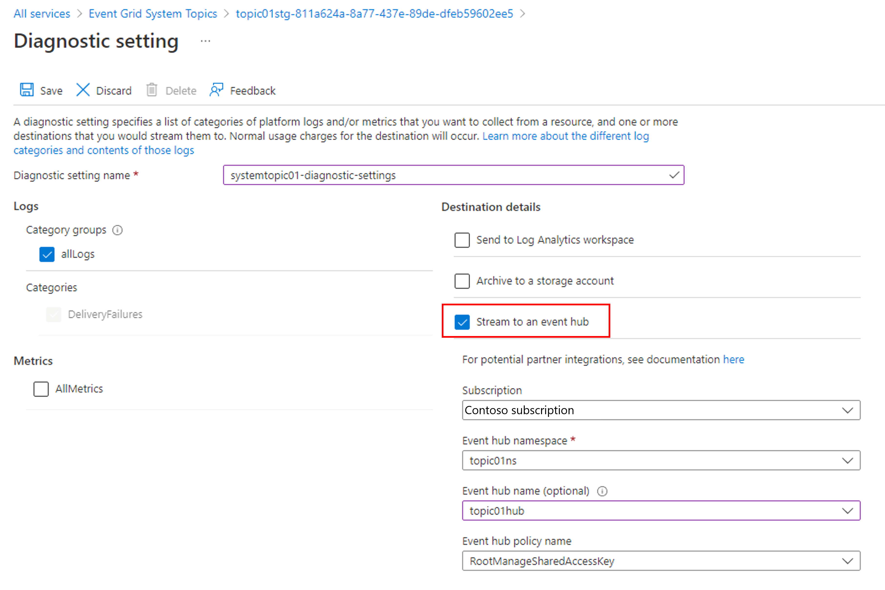

# Enable diagnostic logs for Event Grid resources

This article provides step-by-step instructions for enabling diagnostic settings for Event Grid resources. These settings allow you to capture and view diagnostic information so that you can troubleshoot any failures. The following table shows the settings available for different types of Event Grid resources - custom topics, system topics, and domains.

| Diagnostic setting |  Event Grid topics | Event Grid system topics | Event domains | Event Grid partner namespaces |
| ------------- |  --------- | ----------- | ----------- | ----------- |
| [DeliveryFailures](monitor-push-reference.md#schema-for-publishdelivery-failure-logs)  | Yes | Yes | Yes | No |
| [PublishFailures](monitor-push-reference.md#schema-for-publishdelivery-failure-logs)  | Yes | No | Yes | Yes |
| [DataPlaneRequests](monitor-push-reference.md#schema-for-data-plane-operations-logs) | Yes | No | Yes | Yes |

> [!IMPORTANT]
> For schemas of delivery failures, publish failures, and data plane requests, see [Diagnostic logs](monitor-push-reference.md). 

## Prerequisites

- A provisioned Event Grid resource 
- A provisioned destination for capturing diagnostic logs:
  - Log Analytics workspace
  - Storage account
  - Event Hubs
  - Partner solution

## Enable diagnostic logs for Event Grid topics and domains

> [!NOTE]
> The following procedure provides step-by-step instructions for enabling diagnostic logs for topics. Steps for enabling diagnostic logs for a domain are very similar. In step 2, navigate to the Event Grid **domain** in the Azure portal.  

1. Sign in to the [Azure portal](https://portal.azure.com).
2. Navigate to the Event Grid topic for which you want to enable diagnostic log settings.
    1. In the search bar at the top, search for **Event Grid topics**.
        
    2. Select the **topic** from the list for which you want to configure diagnostic settings.
3. Select **Diagnostic settings** under **Monitoring** in the left menu.
4. On the **Diagnostic settings** page, select **Add New Diagnostic Setting**.
    
5. Specify a **name** for the diagnostic setting.
6. Select the **allLogs** option in the **Logs** section.
    
7. Enable one or more of the capture destinations for the logs, and then configure them by selecting a previous created capture resource.
    - If you select **Archive to a storage account**, select **Storage account - Configure**, and then select the storage account in your Azure subscription.
        
    - If you select **Stream to an event hub**, select **Event hub - Configure**, and then select the Event Hubs namespace, event hub, and the access policy.
        
    - If you select **Send to Log Analytics**, select the Log Analytics workspace.
        
8. Select **Save**. Then, select **X** in the right-corner to close the page.
9. Now, back on the **Diagnostic settings** page, confirm that you see a new entry in the **Diagnostics Settings** table.
    

You can also enable collection of all metrics for the topic.

## Enable diagnostic logs for Event Grid system topics

1. Sign in to the [Azure portal](https://portal.azure.com).
2. Navigate to the system topic for which you want to enable diagnostic log settings.
    1. In the search bar at the top, search for **Event Grid system topics**.
        
    1. Select the **system topic** for which you want to configure diagnostic settings.
        
3. Select **Diagnostic settings** under **Monitoring** on the left menu, and then select **Add diagnostic setting**.
    
4. Specify a **name** for the diagnostic setting.
5. Select the **allLogs** option in the **Logs** section.
    
6. Enable one or more of the capture destinations for the logs, and then configure them by selecting a previous created capture resource.
    - If you select **Send to Log Analytics**, select the Log Analytics workspace.
        
    - If you select **Archive to a storage account**, select **Storage account - Configure**, and then select the storage account in your Azure subscription.
        
    - If you select **Stream to an Event Hub**, select **Event Hub - Configure**, and then select the Event Hubs namespace, event hub, and the access policy.
        
7. Select **Save**. Then, select **X** in the right-corner to close the page.
8. Now, back on the **Diagnostic settings** page, confirm that you see a new entry in the **Diagnostics Settings** table.
    

You can also enable collection of all **metrics** for the system topic.
    

## View diagnostic logs in Azure Storage

1. Once you enable a storage account as a capture destination, Event Grid starts emitting diagnostic logs. You should see new containers named **insights-logs-deliveryfailures** and **insights-logs-publishfailures** in the storage account.

    
2. As you navigate through one of the containers, you'll end up at a blob in JSON format. The file contains log entries for either a delivery failure or a publish failure. The navigation path represents the **ResourceId** of the Event Grid topic and the timestamp (minute level) as to when the log entries were emitted. The blob/JSON file, which is downloadable, in the end adheres to the schema described in the next section.

    
3. You should see content in the JSON file similar to the following example:

    ```json
    {
        "time": "2019-11-01T00:17:13.4389048Z",
        "resourceId": "/SUBSCRIPTIONS/SAMPLE-SUBSCTIPTION-ID /RESOURCEGROUPS/SAMPLE-RESOURCEGROUP-NAME/PROVIDERS/MICROSOFT.EVENTGRID/TOPICS/SAMPLE-TOPIC-NAME ",
        "eventSubscriptionName": "SAMPLEDESTINATION",
        "category": "DeliveryFailures",
        "operationName": "Deliver",
        "message": "Message:outcome=NotFound, latencyInMs=2635, id=xxxxxxxx-xxxx-xxxx-xxxx-xxxxxxxxxxxxx, systemId=xxxxxxx-xxxx-xxxx-xxxx-xxxxxxxxxxxx, state=FilteredFailingDelivery, deliveryTime=11/1/2019 12:17:10 AM, deliveryCount=0, probationCount=0, deliverySchema=EventGridEvent, eventSubscriptionDeliverySchema=EventGridEvent, fields=InputEvent, EventSubscriptionId, DeliveryTime, State, Id, DeliverySchema, LastDeliveryAttemptTime, SystemId, fieldCount=, requestExpiration=1/1/0001 12:00:00 AM, delivered=False publishTime=11/1/2019 12:17:10 AM, eventTime=11/1/2019 12:17:09 AM, eventType=Type, deliveryTime=11/1/2019 12:17:10 AM, filteringState=FilteredWithRpc, inputSchema=EventGridEvent, publisher=DIAGNOSTICLOGSTEST-EASTUS.EASTUS-1.EVENTGRID.AZURE.NET, size=363, fields=Id, PublishTime, SerializedBody, EventType, Topic, Subject, FilteringHashCode, SystemId, Publisher, FilteringTopic, TopicCategory, DataVersion, MetadataVersion, InputSchema, EventTime, fieldCount=15, url=sb://diagnosticlogstesting-eastus.servicebus.windows.net/, deliveryResponse=NotFound: The messaging entity 'sb://diagnosticlogstesting-eastus.servicebus.windows.net/eh-diagnosticlogstest' could not be found. TrackingId:c98c5af6-11f0-400b-8f56-c605662fb849_G14, SystemTracker:diagnosticlogstesting-eastus.servicebus.windows.net:eh-diagnosticlogstest, Timestamp:2019-11-01T00:17:13, referenceId: ac141738a9a54451b12b4cc31a10dedc_G14:"
    }
    ```

## Use Azure Resource Manager template

Here's a sample Azure Resource Manager template to enable diagnostic settings for an Event Grid topic. When you deploy this sample template, the following resources are created.

- An Event Grid topic
- A Log Analytics workspace

Then, it creates a diagnostic setting on the topic to send diagnostic information to the Log Analytics workspace.

```json
{
    "$schema": "https://schema.management.azure.com/schemas/2019-04-01/deploymentTemplate.json#",
    "contentVersion": "1.0.0.0",
    "parameters": {
        "topic_name": {
            "defaultValue": "spegrid0917topic",
            "type": "String"
        },
        "log_analytics_workspace_name": {
            "defaultValue": "splogaw0625",
            "type": "String"
        },
        "location": {
            "defaultValue": "eastus",
            "type": "String"
        },
        "sku": {
            "defaultValue": "Free",
            "type": "String"
        }
    },
    "variables": {},
    "resources": [
        {
            "type": "Microsoft.EventGrid/topics",
            "apiVersion": "2020-10-15-preview",
            "name": "[parameters('topic_name')]",
            "location": "[parameters('location')]",
            "sku": {
                "name": "Basic"
            },
            "kind": "Azure",
            "identity": {
                "type": "None"
            },
            "properties": {
                "inputSchema": "EventGridSchema",
                "publicNetworkAccess": "Enabled"
            }
        },
        {
            "apiVersion": "2017-03-15-preview",
            "name": "[parameters('log_analytics_workspace_name')]",
            "location": "[parameters('location')]",
            "type": "Microsoft.OperationalInsights/workspaces",
            "properties": {
                "sku": {
                    "name": "[parameters('sku')]"
                }
            }
        },
        {
            "type": "Microsoft.EventGrid/topics/providers/diagnosticSettings",
            "apiVersion": "2017-05-01-preview",
            "name": "[concat(parameters('topic_name'), '/', 'Microsoft.Insights/', parameters('log_analytics_workspace_name'))]",
            "location": "[parameters('location')]",
            "dependsOn": [
                "[resourceId('Microsoft.EventGrid/topics', parameters('topic_name'))]",
                "[resourceId('Microsoft.OperationalInsights/workspaces', parameters('log_analytics_workspace_name'))]"
            ],
            "properties": {
                "workspaceId": "[resourceId('Microsoft.OperationalInsights/workspaces', parameters('log_analytics_workspace_name'))]",
                "metrics": [
                    {
                        "category": "AllMetrics",
                        "enabled": true
                    }
                ],
                "logs": [
                    {
                        "category": "DeliveryFailures",
                        "enabled": true
                    },
                    {
                        "category": "PublishFailures",
                        "enabled": true
                    }
                ]
            }
        }
    ]
}
```

## Enable diagnostic logs for audit traces

Event Grid can publish audit traces for data plane operations. To enable the feature, select **audit** in the **Category groups** section or select **DataPlaneRequests** in the **Categories** section.

The audit trace can be used to ensure that data access is allowed only for authorized purposes. It collects information about security control such as resource name, operation type, network access, level, region and more. For more information about how to enable the diagnostic setting, see [Diagnostic logs in Event Grid topics and Event domains](enable-diagnostic-logs-topic.md#enable-diagnostic-logs-for-event-grid-topics-and-domains).


> [!IMPORTANT]
> For more information about the `DataPlaneRequests` schema, see [Diagnostic logs](monitor-push-reference.md).

## Next steps

For the log schema and other conceptual information about diagnostic logs for topics or domains, see [Diagnostic logs](monitor-push-reference.md).
