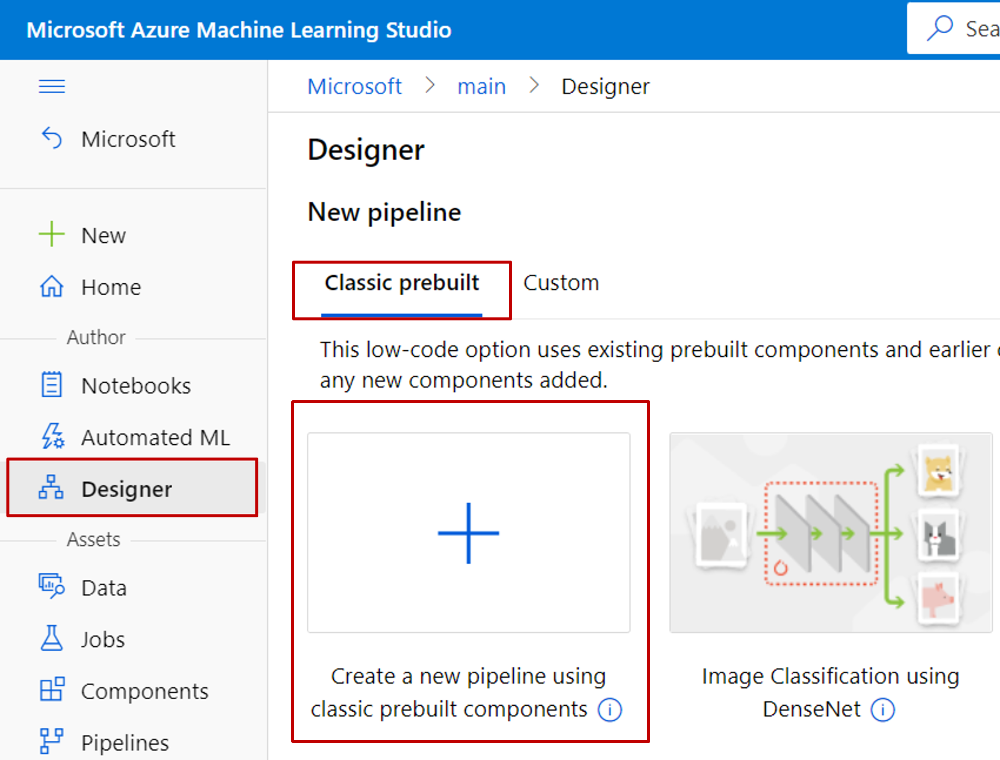

# Rebuild a Studio (classic) experiment in Azure Machine Learning

[!INCLUDE [ML Studio (classic) retirement](../../../includes/machine-learning-studio-classic-deprecation.md)]

In this article, you learn how to rebuild an ML Studio (classic) experiment in Azure Machine Learning. For more information on migrating from Studio (classic), see [the migration overview article](migrate-overview.md).

Studio (classic) **experiments** are similar to **pipelines** in Azure Machine Learning. However, in Azure Machine Learning pipelines are built on the same back-end that powers the SDK. This means that you have two options for machine learning development: the drag-and-drop designer or code-first SDKs.

For more information on building pipelines with the SDK, see [What are Azure Machine Learning pipelines](../concept-ml-pipelines.md).

## Prerequisites

- An Azure account with an active subscription. [Create an account for free](https://azure.microsoft.com/free/?WT.mc_id=A261C142F).
- An Azure Machine Learning workspace. [Create workspace resources](../quickstart-create-resources.md).
- A Studio (classic) experiment to migrate.
- [Upload your dataset](migrate-register-dataset.md) to Azure Machine Learning.

## Rebuild the pipeline

After you [migrate your dataset to Azure Machine Learning](migrate-register-dataset.md), you're ready to recreate your experiment.

In Azure Machine Learning, the visual graph is called a **pipeline draft**. In this section, you recreate your classic experiment as a pipeline draft.

1. Go to Azure Machine Learning studio ([ml.azure.com](https://ml.azure.com))
1. In the left navigation pane, select **Designer** > **Easy-to-use prebuilt modules**
    

1. Manually rebuild your experiment with designer components.
    
    Consult the [module-mapping table](migrate-overview.md#studio-classic-and-designer-component-mapping) to find replacement modules. Many of Studio (classic)'s most popular modules have identical versions in the designer.

    > [!Important]
    > If your experiment uses the Execute R Script module, you need to perform additional steps to migrate your experiment. For more information, see [Migrate R Script modules](migrate-execute-r-script.md).

1. Adjust parameters.
    
    Select each module and adjust the parameters in the module settings panel to the right. Use the parameters to recreate the functionality of your Studio (classic) experiment. For more information on each module, see the [module reference](../component-reference/component-reference.md).

## Submit a job and check results

After you recreate your Studio (classic) experiment, it's time to submit a **pipeline job**.

A pipeline job executes on a **compute target** attached to your workspace. You can set a default compute target for the entire pipeline, or you can specify compute targets on a per-module basis.

Once you submit a job from a pipeline draft, it turns into a **pipeline job**. Each pipeline job is recorded and logged in Azure Machine Learning.

To set a default compute target for the entire pipeline:

1. Select the **Gear icon**  next to the pipeline name.
1. Select **Select compute target**.
1. Select an existing compute, or create a new compute by following the on-screen instructions.

Now that your compute target is set, you can submit a pipeline job:

1. At the top of the canvas, select **Submit**.
1. Select **Create new** to create a new experiment.
    
    Experiments organize similar pipeline jobs together. If you run a pipeline multiple times, you can select the same experiment for successive jobs. This is useful for logging and tracking.
1. Enter an experiment name. Then, select **Submit**.

    The first job may take up to 20 minutes. Since the default compute settings have a minimum node size of 0, the designer must allocate resources after being idle. Successive jobs take less time, since the nodes are already allocated. To speed up the running time, you can create a compute resource with a minimum node size of 1 or greater.

After the job finishes, you can check the results of each module:

1. Right-click the module whose output you want to see.
1. Select either **Visualize**, **View Output**, or **View Log**.

    - **Visualize**: Preview the results dataset.
    - **View Output**: Open a link to the output storage location. Use this to explore or download the output. 
    - **View Log**: View driver and system logs. Use the **70_driver_log** to see information related to your user-submitted script such as errors and exceptions.

> [!IMPORTANT]
> Designer components use open source Python packages to implement machine learning algorithms. However Studio (classic) uses a Microsoft internal C# library. Therefore, prediction result may vary between the designer and Studio (classic).

## Save trained model to use in another pipeline

Sometimes you may want to save the model trained in a pipeline and use the model in another pipeline later. In Studio (classic), all trained models are saved in "Trained Models" category in the module list. In designer, the trained models are automatically registered as file dataset with a system generated name. Naming convention follows "MD - pipeline draft name - component name - Trained model ID" pattern.

To give a trained model a meaningful name, you can register the output of **Train Model** component as a **file dataset**. Give it the name you want, for example linear-regression-model. 

You can find the trained model in "Dataset" category in the component list or search it by name. Then connect the trained model to a **Score Model** component to use it for prediction. 

## Next steps

In this article, you learned how to rebuild a Studio (classic) experiment in Azure Machine Learning. The next step is to [rebuild web services in Azure Machine Learning](migrate-rebuild-web-service.md).

See the other articles in the Studio (classic) migration series:

1. [Migration overview](migrate-overview.md).
1. [Migrate dataset](migrate-register-dataset.md).
1. **Rebuild a Studio (classic) training pipeline**.
1. [Rebuild a Studio (classic) web service](migrate-rebuild-web-service.md).
1. [Integrate an Azure Machine Learning web service with client apps](migrate-rebuild-integrate-with-client-app.md).
1. [Migrate Execute R Script](migrate-execute-r-script.md).
